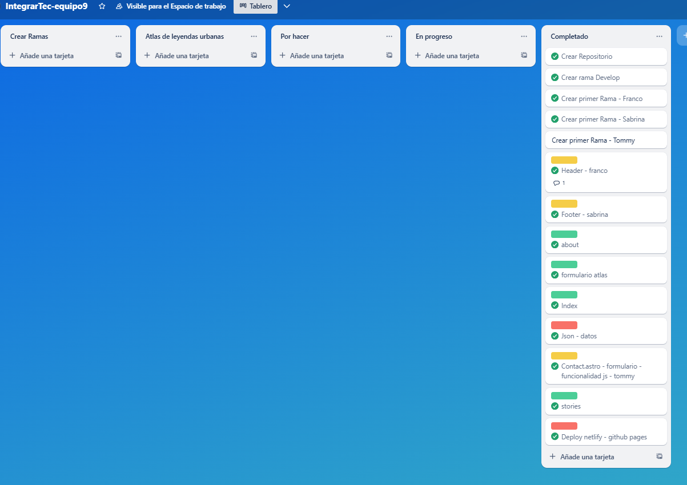

# CONTRIBUTING

## Nuestro trabajo en equipo

Este proyecto fue desarrollado en equipo por el Grupo 9 durante el programa IntegrarTec. Para organizarnos y colaborar de manera eficiente, seguimos estas prácticas:

- **Ramas por funcionalidad:** Para desarrollar nuevas funcionalidades o corregir errores y evitar conflictos.
Nos organizamos las ramas nombrandolas `feature/header` de asi tal que `feature/...`.
- **Revisiones de código:** Antes de integrar cambios a la `develop`, hicimos revisiones de código en nuestras ramas `feature/...` mediante Pull Requests para asegurar calidad y consenso.
- **Comunicación constante:** Se hizo uso de herramientas de comunicación (como Discord, WhatsApp) para organizar tareas y resolver dudas rápidamente.
- **Uso de Git:** Hicimos commits frecuentes con mensajes claros y descriptivos para mantener un historial ordenado y facilitar la colaboración.
- **Integración continua:** La rama `develop` se mantuvo siempre actualizada y estable, integrando cambios después de la revisión y pruebas básicas.
- **Respeto y colaboración:** Fomentamos un ambiente respetuoso y colaborativo, valorando las aportaciones de nuestros miembros.

## Organización de tareas

Para gestionar y visualizar el progreso del proyecto, utilizamos Trello con los tableros y columnas siguientes:

- **Por hacer:** Tareas pendientes y definidas para ser tomadas.
- **En progreso:** Tareas que están siendo desarrolladas o revisadas.
- **Completado:** Tareas finalizadas y aprobadas.

Esta metodología nos permitió mantener el control del avance y distribuir las responsabilidades de forma clara entre los integrantes.

### Nos organizamos 

---

