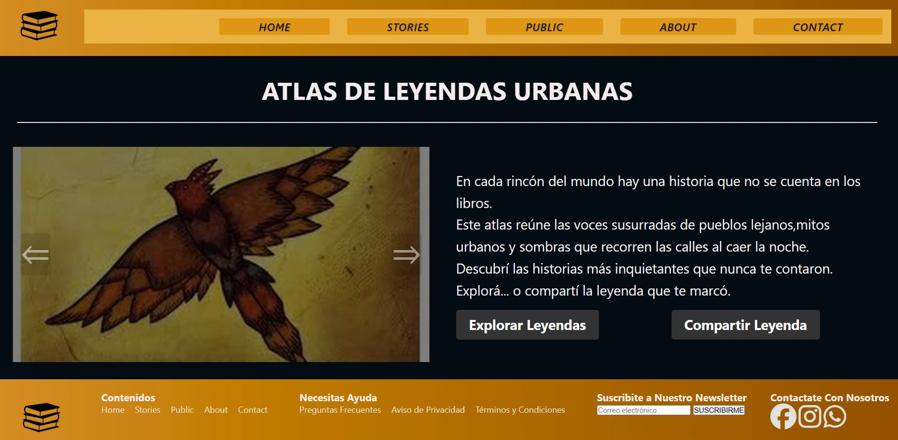
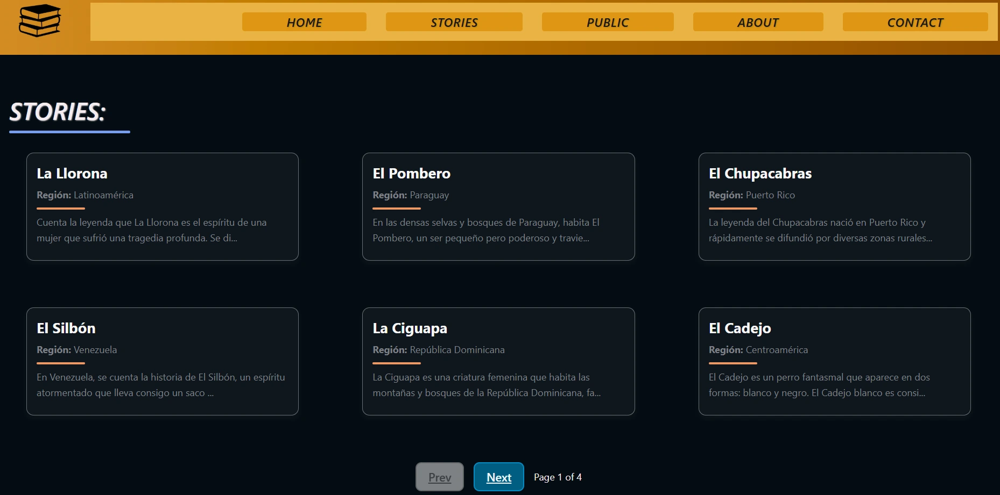

```markdown
# Grupo9 - Proyecto IntegrarTec

## Nombre del proyecto: ATLAS DE LEYENDAS URBANAS

## 📚 Descripción del proyecto

Este es un proyecto desarrollado como parte del trabajo grupal para IntegrarTec. El objetivo del proyecto es crear una plataforma para visualizar historias de usuarios, este atlas reúne las voces susurradas de pueblos lejanos,mitos urbanos y sombras que recorren las calles al caer la noche.

## objetivo del repositorio

Este repositorio contiene el proyecto realizado por el Grupo 9 en el marco del programa **IntegrarTec**. El objetivo principal fue desarrollar un sitio web estático y **responsive** para dispositivos móviles y tablets, que permita visualizar y explorar historias utilizando **Astro** como framework principal.


---

## 📦 Tecnologías utilizadas

- ⚡ [Astro](https://astro.build/) – Framework de frontend moderno
- 📦 [pnpm](https://pnpm.io/) – Gestor de paquetes rápido y eficiente
- 🌐 HTML, CSS, JavaScript

---

## Requisitos previos

- Node.js v20 o superior
- pnpm

## Instalación

1. Cloná el repositorio:

```bash
git clone https://github.com/sabriortiz/Grupo9.git
cd Grupo9
```

2.  Instalá las dependencias con pnpm:

```bash
pnpm install ## en caso de pedir
```

3. Ejecutá el entorno de desarrollo:

```bash
pnpm dev  
```

4. Abrí tu navegador en: http://localhost:4321

## Imagenes del sitio

### Vista previa del proyecto



### Página de historias




## Participantes
- Franco Torrico
- Tommy Jamiro quispe
- Sabrina Ortiz

# Link del proyecto:

Url del proyecto: https://sabriortiz.github.io/Grupo9/